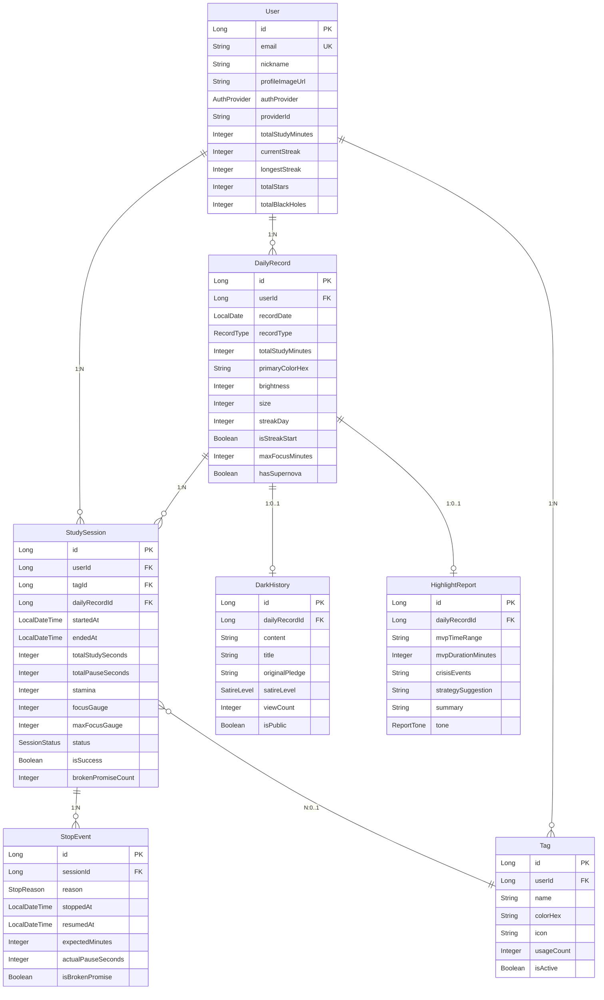

# Starlogue 도메인 설계 문서

##  ERD (Entity Relationship Diagram)



---

##  도메인 구조

```
domain/
├── common/
│   └── BaseTimeEntity.java       # JPA Auditing (생성일/수정일)
├── user/
│   ├── User.java                 # 사용자 엔티티
│   └── AuthProvider.java         # 소셜 로그인 제공자 enum
├── tag/
│   └── Tag.java                  # 과목/주제 태그 (별 색상 결정)
├── session/
│   ├── StudySession.java         # 공부 세션 (핵심 도메인)
│   ├── SessionStatus.java        # 세션 상태 enum
│   ├── Pledge.java               # 다짐/서약 (Embeddable)
│   ├── StopEvent.java            # 중단 이벤트
│   └── StopReason.java           # 중단 사유 enum (페널티 가중치)
├── daily/
│   ├── DailyRecord.java          # 일일 기록 (별/블랙홀)
│   ├── RecordType.java           # 기록 유형 enum
│   ├── HighlightReport.java      # 하루 종료 리포트
│   └── ReportTone.java           # 리포트 톤 enum
└── penalty/
    ├── DarkHistory.java          # 흑역사 (AI 생성 패널티)
    └── SatireLevel.java          # 풍자 레벨 enum
```

---

##  핵심 도메인 설계 의도

### 1. StudySession (공부 세션)
**설계 이유**: 세션이 Starlogue의 핵심 단위입니다. 모든 게임 메카닉(스태미나, 집중 게이지, 베팅)이 여기서 관리됩니다.

| 필드 | 설계 이유 |
|------|----------|
| `stamina` | 기획서 5-A: 세션마다 100 제공, 중단 시 소모 |
| `focusGauge` | 기획서 5-A: 연속 집중 시간의 가치 부여 |
| `Pledge` (Embedded) | 세션에 종속적인 값 객체로 설계, 별도 테이블 불필요 |
| `brokenPromiseCount` | 기획서 5-C: 약속 어김이 흑역사 재료로 활용 |

### 2. StopEvent (중단 이벤트)
**설계 이유**: 기획서 6번의 Stop 시스템을 정확히 반영합니다.

```java
// 약속 어김 판정 로직 (기획서: 유예 시간 없음)
public void resume() {
    this.actualPauseSeconds = Duration.between(stoppedAt, resumedAt).getSeconds();
    int expectedSeconds = this.expectedMinutes * 60;
    this.isBrokenPromise = this.actualPauseSeconds > expectedSeconds;
}
```

### 3. DailyRecord (일일 기록)
**설계 이유**: 기획서 8번 "공부 은하수" 시각화의 데이터 모델입니다.

| RecordType | 시각적 표현 | 조건 |
|------------|------------|------|
| `STAR` | 밝은 별 | 성공한 세션 1개 이상 |
| `BLACK_HOLE` | 블랙홀 | 세션 있지만 모두 실패 |
| `METEORITE` | 차가운 운석 | 세션 없음 (공부 안 함) |

### 4. Pledge (다짐) - @Embeddable
**설계 이유**: 다짐은 세션 없이 독립적으로 존재할 수 없으므로 값 객체로 설계했습니다.

```java
@Embeddable
public class Pledge {
    private String content;           // "2시간 React 공부"
    private Integer targetMinutes;    // 120
    private Integer maxStopCount;     // null = 무제한
    private Integer maxStopDurationMinutes;
}
```

### 5. DarkHistory (흑역사)
**설계 이유**: 기획서 3-B의 패널티 시스템입니다. AI가 생성하는 30~180자 풍자 콘텐츠.

| SatireLevel | 조건 | 톤 |
|-------------|------|-----|
| `MILD` | 약속 어김 없음 | 가벼운 유머 |
| `MODERATE` | 약속 어김 1~2회 | 블랙코미디 |
| `STRONG` | 약속 어김 3회+ 또는 "딴짓" 선택 | 날카로운 풍자 |

---

## 연관관계 정리

```
User (1) ──────── (N) StudySession
  │                      │
  │                      │ N:1
  │                      ▼
  │                    Tag (별 색상 결정)
  │
  └──── (N) DailyRecord
              │
              ├── (N) StudySession
              ├── (0..1) DarkHistory
              └── (0..1) HighlightReport
```

---

##  비정규화 전략

### User 테이블의 집계 필드
조회 성능 최적화를 위해 User에 통계 필드를 비정규화했습니다.

```java
// 매번 집계 쿼리 대신 갱신
public void recordDailySuccess() {
    this.currentStreak++;
    this.totalStars++;
    if (this.currentStreak > this.longestStreak) {
        this.longestStreak = this.currentStreak;
    }
}
```

**장점**: 프로필/대시보드 조회 시 JOIN 없이 바로 표시
**주의**: 세션 종료/일일 정산 시 동기화 필요

---

##  인덱스 

```java
@Table(indexes = {
    @Index(name = "idx_session_user_date", columnList = "user_id, startedAt"),
    @Index(name = "idx_session_status", columnList = "status")
})
public class StudySession { ... }

@Table(indexes = @Index(name = "idx_daily_user_date", columnList = "user_id, record_date DESC"))
public class DailyRecord { ... }
```

| 인덱스 | 용도 |
|--------|------|
| `user_id, startedAt` | 특정 사용자의 기간별 세션 조회 |
| `status` | 진행 중인 세션 조회 |
| `user_id, record_date DESC` | 공부 은하수 시각화 (최신순) |

---
## 🗄️ Repository 계층

```
domain/
├── user/
│   └── UserRepository.java
├── tag/
│   └── TagRepository.java
├── session/
│   ├── StudySessionRepository.java
│   └── StopEventRepository.java
├── daily/
│   ├── DailyRecordRepository.java
│   └── HighlightReportRepository.java
└── penalty/
    └── DarkHistoryRepository.java
```

### 주요 쿼리 메서드

| Repository | 핵심 메서드 | 용도 |
|------------|------------|------|
| `StudySessionRepository` | `findByUserIdAndStatus()` | 진행 중 세션 조회 |
| | `findByUserIdAndDate()` | 특정 날짜 세션들 |
| | `findStaleInProgressSessions()` | 장기 미활동 세션 (배치) |
| `DailyRecordRepository` | `findByUserIdAndPeriod()` | 공부 은하수 시각화 |
| | `findStreakRecords()` | 별자리 연결 |
| | `findPendingRecords()` | 미정산 기록 (배치) |
| `DarkHistoryRepository` | `findUnacknowledged()` | 미확인 흑역사 알림 |
| | `findPublicDarkHistories()` | 커뮤니티 피드 |
